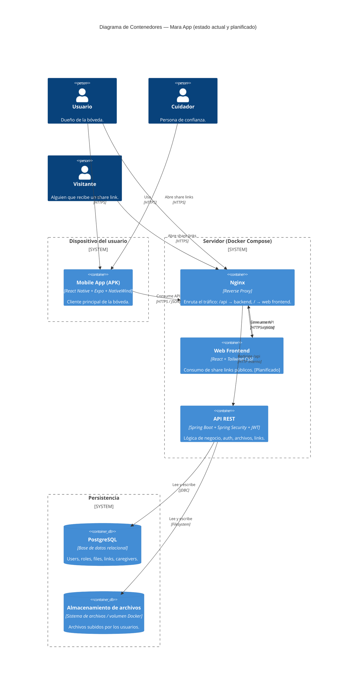
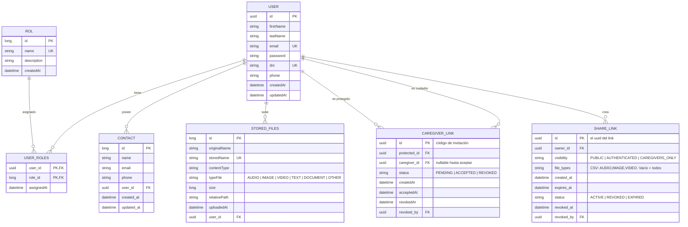
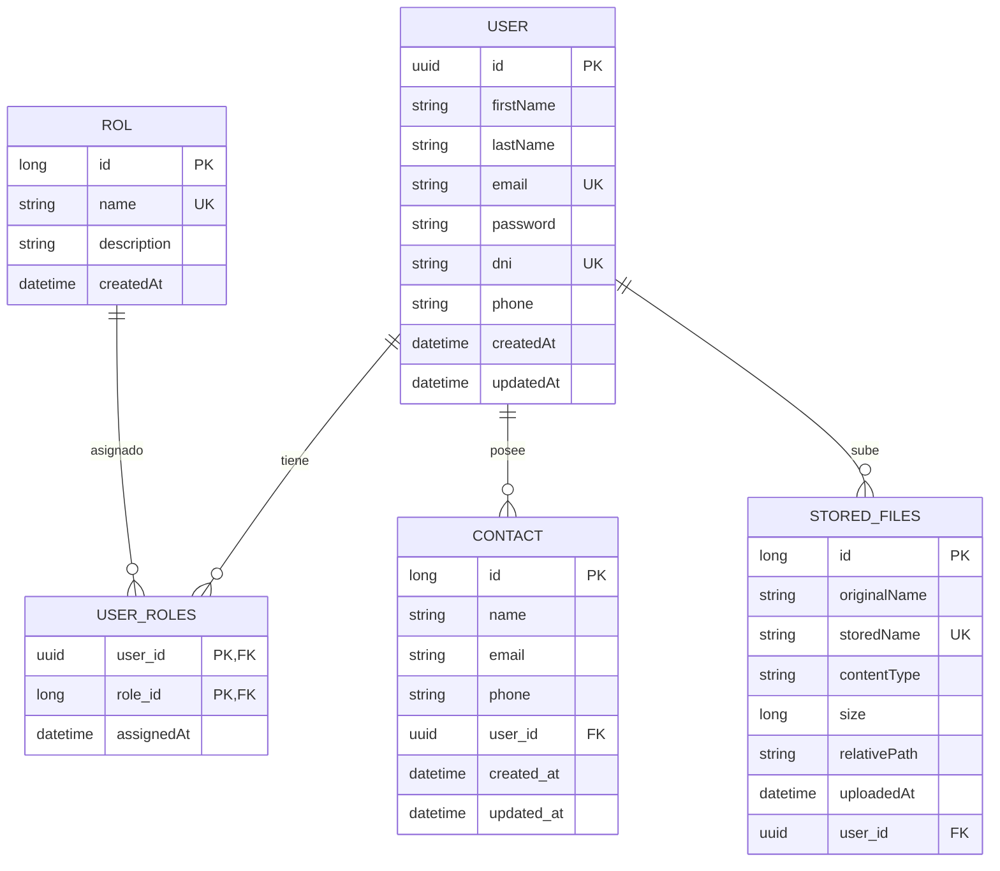

# Mara App — Bóveda Digital Oculta

> Una bóveda digital personal que guarda capturas, audios, videos y textos de forma privada, con la posibilidad de compartirlos de manera segura y temporal con personas de confianza.

---

## Introducción

**Mara App** nace de una necesidad concreta: tener un espacio **oculto y privado** dentro del sistema operativo donde guardar capturas de pantalla, audios, videos y notas de texto sin que queden expuestas en la galería o en el almacenamiento público del dispositivo.

A diferencia de una carpeta oculta común, la bóveda está pensada como un **sistema con capas de confianza**:

- El **usuario** guarda archivos en su bóveda personal, invisible para el resto del sistema.
- El usuario puede designar **cuidadores de confianza** (*caregivers*): otras personas registradas en la app que, tras aceptar un código de invitación, pueden recibir avisos y acceder a ciertos recursos cuando el usuario lo autorice.
- El usuario puede generar **links temporales de compartición** (*share links*) para compartir archivos específicos — o todo su historial filtrado por tipo — con una política de visibilidad configurable: público, solo autenticados, o exclusivamente sus cuidadores aceptados.

La app está pensada **mobile-first** (Expo + React Native), con una futura extensión web para la parte de links públicos, y un backend en **Spring Boot** que centraliza la lógica de negocio, la seguridad y el almacenamiento.

---

## Módulos del sistema

| Módulo | Estado | Descripción |
| :--- | :--- | :--- |
| **Auth & Users** | ✅ Implementado | Registro, login, JWT, roles (USER, ADMIN, CAREGIVER). |
| **Files (StoredFile)** | ✅ Implementado | Subida y metadata de archivos, con clasificación por `TypeFile`. |
| **Contacts** | ✅ Implementado | Libreta de contactos externos (sin cuenta en la app). |
| **Caregiver Links** | 🚧 En diseño | Vinculación protegido ↔ cuidador mediante código UUID. |
| **Share Links** | 🚧 En diseño | Links temporales para compartir archivos con visibilidad configurable. |
| **Notificaciones** | 🔜 Próximamente | Avisos entre protegido y cuidador. |
| **Web Frontend** | 🔜 Próximamente | Consumo de share links públicos desde el navegador. |

---

## Stack Tecnológico

### Backend

### Frontend Web

### Mobile

### Base de Datos & ORM

### Seguridad & Autenticación

### Tools & DevOps

### Testing

---

## Arquitectura (C4 Model)

### Nivel 2 — Contenedores (estado actual + planificado)

A medida que agregamos la parte web (para consumir share links públicos desde el navegador), se suma un **Nginx** como reverse proxy que servirá tanto el frontend web como la API.

> **Nota:** el contenedor **Web Frontend** y el enrutamiento de **Nginx** hacia él todavía no existen. Están modelados para anticipar la arquitectura objetivo.

---

## Modelo de Datos (DER)

---

## 🚀 Roadmap

### Fase 1 — Núcleo (completado)
- [x] Autenticación con JWT y roles.
- [x] Gestión de usuarios y contactos.
- [x] Subida y almacenamiento de archivos con clasificación `TypeFile`.

### Fase 2 — Confianza y compartición (en curso)
- [ ] Módulo **Caregiver Links** (vinculación protegido ↔ cuidador).
- [ ] Módulo **Share Links** (links temporales con visibilidad configurable).
- [ ] Validación en vivo de `CAREGIVERS_ONLY` contra `CaregiverLink`.

### Fase 3 — Expansión web
- [ ] Frontend web en React + Tailwind para consumir share links públicos.
- [ ] Nginx como reverse proxy dentro del `docker-compose`.
- [ ] Enrutamiento: `/api` → Spring Boot, `/` → React.

### Fase 4 — Notificaciones y extras
- [ ] Notificaciones push entre protegido y cuidador.
- [ ] Panel de administración.
- [ ] Estadísticas de uso por tipo de archivo.

---

## Documentación adicional

- [`docs/SPRINT_2/typefile-enum.md`](docs/SPRINT_2/AGREGAR_enum_TypeFile.html) — Clasificación de archivos.
- [`docs/SPRINT_3/MODULO_CUIDADORES.html`](docs/SPRINT_3/MODULO_CUIDADORES.html) — Diseño del módulo Caregiver.
- [`docs/SPRINT_3/MODULO_COMPARTIR_LINKS.html`](docs/SPRINT_3/MODULO_COMPARTIR_LINKS.html) — Diseño del módulo ShareLink.

---

## 👥 Equipo

Proyecto académico/portfolio desarrollado por el equipo de Vault App.

---

## Licencia

Por definir.

